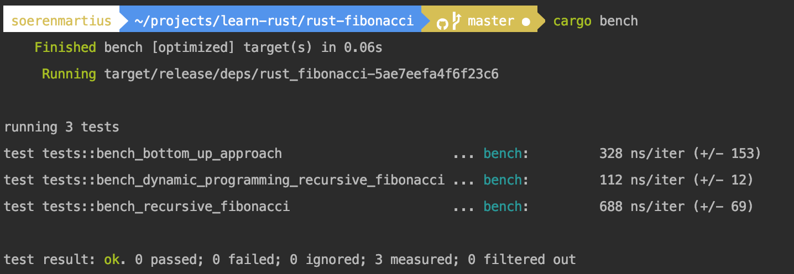

# rust-fibonacci
How to calculate the fibonacci sequence in Rust with a Recursion, memoized solution and bottom up approached.




Note: This example runs on Rust nightly because it uses the unstable test feature for benchmarking. 

## Install Rust Nightly
```bash
rustup install nightly
rustup default nightly
```

## Run the tests
```bash
cargo test
```

## Run the benchmark tests
```bash
cargo bench
```
